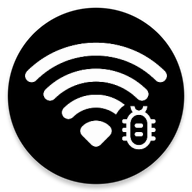

<!--
    SPDX-FileCopyrightText: NONE

    SPDX-License-Identifier: Unlicense
-->
en|[ru](README.ru.md)

<p align="center">
    
</p>

<h1 align="center">WAdbSwitch</h1>

This app can toggle state of wireless debugging via [android broadcasts](https://developer.android.com/develop/background-work/background-tasks/broadcasts).

App was made for terminal emulators (like [termux](https://github.com/termux/termux-app)) that cant toggle state of wireless debugging directly or via `cmd settings` (since that requires `android.permission.MANAGE_USERS`).

If enabled in `Developer options > Quick settings developer tiles`, Wireless debugging can be toggled manually from quick settings.

## Download

[](https://codeberg.org/kulakov444/WAdbSwitch/releases)
[](https://github.com/kulakov444/WAdbSwitch/releases)

### Verification

Authenticity of downloaded apk can be verified using methods below.

#### [apksigner](https://developer.android.com/studio/command-line/apksigner#usage-verify)

```shell
apksigner verify --print-certs WAdbSwitch-*.*.apk
```

SHA256 hash of signing certificate should match `62c93a6a70c86129d0c8652fd9abca7826f9a11aeaf0ceb2591004606284cc53`

#### [AppVerifier](https://github.com/soupslurpr/AppVerifier)

Verification info:

```
name.kulakov444.wadbswitch
62:C9:3A:6A:70:C8:61:29:D0:C8:65:2F:D9:AB:CA:78:26:F9:A1:1A:EA:F0:CE:B2:59:10:04:60:62:84:CC:53
```

## Installation

App targets Android 11 or higher, since wireless debug option was not supported before (without `adb tcpip`).

App requires `android.permission.WRITE_SECURE_SETTINGS` to be functional.

Permission can be granted via `adb shell`:

```shell
pm grant name.kulakov444.wadbswitch android.permission.WRITE_SECURE_SETTINGS
```

## Usage

128 bit flag encoded in base64 is used rather than android permissions, since that requires broadcast sender to declare permission in manifest.

Broadcast should be sent to the package `name.kulakov444.wadbswitch` with action `name.kulakov444.wadbswitch.SWITCH` and two extras:

- `flag` Must match 128 bit key generated by the app
- `value` state of wireless debugging

Via am:

```shell
PACKAGE=name.kulakov444.wadbswitch
am broadcast           \
    -a $PACKAGE.SWITCH \
    --es flag $FLAG    \
    --ei value $1      \
    $PACKAGE           \

```

In kotlin:

```kotlin
private fun setWAdb(flag: String, value: Int) {
    val `package` = "name.kulakov444.wadbswitch"
    val intent = Intent()
    intent.action = `package`
    intent.putExtra("flag", flag)
    intent.putExtra("value", value)
    intent.`package` = `package`
    sendBroadcast(intent)
}

```

In java:

```java
private void setWAdb(String flag, int value) {
    String p = "name.kulakov444.wadbswitch";
    Intent intent = new Intent();
    intent.setAction(p + ".SWITCH");
    intent.putExtra("flag", flag);
    intent.putExtra("value", value);
    intent.setPackage(p);
    sendBroadcast(intent);
}

```

## Building

To build debug apk run `assembleDebug` gradle task.

To build release apk run `assembleRelease` grade task.

